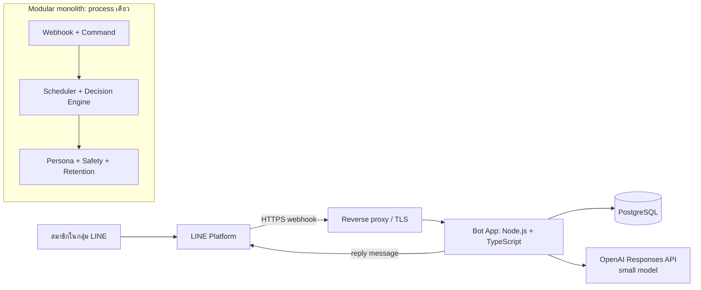

# Architecture: LINE AI Group Bot

สถานะ: Proposed  
ปรับปรุงล่าสุด: 2026-08-13

## 1. เป้าหมาย

บอททำหน้าที่เหมือนเพื่อนอีกคนในกลุ่ม ไม่ใช่ผู้ช่วยที่ตอบทุกข้อความ:

1. ตอบเสมอเมื่อถูก `@mention`, ถูก reply ถึง หรือได้รับคำสั่งที่ถูกต้อง
2. เลือกตอบข้อความทั่วไปเพียง 5–10% เมื่อช่วยให้วงสนทนาเดินต่อได้
3. เรียนรู้ persona ของสมาชิก เช่น อาหารที่ชอบ งานอดิเรก ทักษะ และเรื่องความสัมพันธ์
4. ใช้ persona เพื่อแซวหรือเชื่อมบทสนทนาได้ภายใต้ Safety Gate
5. ให้สมาชิกดู แก้ และลบข้อมูลของตัวเองได้

MVP ทำเพื่อความสนุก จึงให้ความสำคัญกับต้นทุนและความเรียบง่ายมากกว่าความแม่นยำสูงสุด

## 2. ขอบเขตและข้อจำกัด

- กลุ่ม LINE เดียว สมาชิกน้อยกว่า 50 คน และข้อความน้อยกว่า 1,000 ข้อความต่อวัน
- เริ่มเรียนรู้ตั้งแต่เชิญบอทเข้ากลุ่ม ไม่ import ประวัติเดิม
- รองรับข้อความ, emoji และ metadata ของ sticker
- ไม่ดาวน์โหลดหรือวิเคราะห์รูป วิดีโอ เสียง และไฟล์ใน MVP
- ไทยปนอังกฤษ คำย่อ คำผิด และคำหยาบเป็น input ปกติ
- ไม่มี dashboard, vector database, embeddings, Redis หรือระบบสำรองข้อมูล
- ไม่มี scheduled icebreaker ใน MVP
- ใช้ small model ตัวเดียวสำหรับ classification, generation และ persona extraction
- บอทแจ้งว่ามีการสร้าง persona และมีคำสั่งจัดการข้อมูล แต่ไม่มี consent workflow แบบกดยืนยัน

## 3. ภาพรวมระบบ



Deploy เป็นสอง container หลัก:

- `bot-app`: HTTP webhook และ background job loop อยู่ใน process เดียว
- `postgres`: event store, delayed jobs, messages, persona และ settings

ใช้ reverse proxy ที่มีอยู่บนเครื่อง หรือ Caddy บน host เพื่อ terminate HTTPS ไม่แยก service จนกว่าปริมาณงานจะพิสูจน์ว่าจำเป็น

## 4. โมดูลในแอป

| โมดูล | หน้าที่ |
|---|---|
| `line-adapter` | verify signature จาก raw body, parse webhook, เรียก reply/profile API |
| `webhook-ingest` | dedupe, บันทึก event/message และคืน `2xx` อย่างเร็ว |
| `command-service` | parse คำสั่งแบบ deterministic และตรวจสิทธิ์จาก LINE `userId` |
| `conversation-service` | สร้าง episode/window และตรวจว่ามนุษย์ตอบไปแล้วหรือไม่ |
| `job-runner` | poll delayed jobs จาก PostgreSQL และ lock งานแบบ atomic |
| `decision-engine` | hard rules, cooldown, small-model judge และ response budget |
| `persona-service` | สกัด observation, resolve fact, confidence/decay และ alias |
| `ai-client` | OpenAI Responses API, JSON Schema, timeout/retry และ token accounting |
| `safety-gate` | กันหัวข้อต้องห้าม ข้อมูลลับ การโจมตี และ prompt injection |
| `retention-service` | ลบ raw messages 30 วัน, logs 7 วัน และ decay facts 180 วัน |
| `telemetry` | structured logs, latency, token usage, decisions และ feedback |

## 5. เส้นทางรับ webhook

1. รับ `POST /webhooks/line` เป็น raw UTF-8 body
2. verify `x-line-signature` ด้วย channel secret ก่อน parse JSON
3. ถ้า signature ผิดให้ปฏิเสธทันที
4. insert `webhook_events` ด้วย unique `webhook_event_id`; duplicate ให้ตอบ `2xx` โดยไม่ประมวลผลซ้ำ
5. บันทึก event/message และสร้าง job ที่จำเป็นใน transaction เดียว
6. คืน `2xx` ให้ LINE แล้วค่อยทำ AI work แบบ asynchronous
7. ใช้ `timestamp` ของ event เป็นลำดับจริง เพราะ redelivery อาจมาผิดลำดับ

ข้อกำหนดนี้สอดคล้องกับ LINE ซึ่งแนะนำ async processing, signature verification และ dedupe ด้วย `webhookEventId`:

- https://developers.line.biz/en/docs/messaging-api/verify-webhook-signature/
- https://developers.line.biz/en/docs/messaging-api/receiving-messages/

เมื่อได้รับ `unsend` event ระบบต้องลบข้อความต้นทาง, cancel job ที่เกี่ยวข้อง และ invalidate observation/fact ที่มีข้อความนั้นเป็นหลักฐาน แม้ retention ปกติจะยังไม่ครบกำหนด

## 6. Selective response pipeline

### 6.1 Direct path

ถือว่าเป็น direct invocation เมื่อ:

- `mention.mentionees[].isSelf = true`
- ผู้ใช้ reply/quote ถึงข้อความของบอทที่ระบบรู้จัก
- ข้อความตรงกับ command grammar และมี `@bot`

เป้าหมาย latency 3–5 วินาที ข้าม random sampling แต่ยังผ่าน authorization และ Safety Gate

### 6.2 Ambient path

1. hard filter ตัด sticker-only, `555`, acknowledgment สั้น, duplicate, bot cooldown และข้อความที่ไม่ใช่ text
2. สร้าง candidate job ที่ due ใน 15–30 วินาที
3. เมื่อถึงเวลา ดึงไม่เกิน 20–30 ข้อความล่าสุดและไม่เกิน 10 นาที
4. ถ้ามนุษย์ตอบประเด็นนั้นแล้ว, มีกิจกรรมใหม่ที่ทำให้คำตอบล้าสมัย หรือ cooldown ยังไม่ครบ ให้ยกเลิก
5. small model คืน structured decision
6. ถ้า `respond = true` ให้สร้างข้อความสั้นและผ่าน Safety Gate
7. ส่งด้วย LINE reply API เฉพาะเมื่อ reply token ยังสด

ค่าเริ่มต้น:

- ambient response rate target: 5–10%
- ไม่เกิน 1 ambient response ต่อ 10 ข้อความ
- cooldown หลังบอทตอบเอง: 3–5 นาที
- direct invocation: ตอบเสมอยกเว้นถูก mute หรือผิด Safety Gate
- daily AI token budget: เมื่อเต็มให้เหลือเฉพาะ direct invocation และ commands

LINE ระบุว่า reply token ใช้ได้ครั้งเดียวและควรใช้โดยเร็ว การใช้งานเกินหนึ่งนาทีไม่รับประกัน ดังนั้น job ที่ฟื้นหลัง restart จะส่งต่อเมื่ออายุยังอยู่ใน safety margin เช่นไม่เกิน 45 วินาที มิฉะนั้นยกเลิก ไม่เปลี่ยนเป็น push อัตโนมัติ:

- https://developers.line.biz/en/reference/messaging-api/#send-reply-message
- https://developers.line.biz/en/docs/messaging-api/sending-messages/

### 6.3 Structured decision

ใช้ JSON Schema แบบ strict และ validate ฝั่งแอปอีกครั้ง:

```json
{
  "respond": true,
  "reason": "can_add_fun",
  "interest_score": 0.76,
  "answered_by_human": false,
  "safety": "allowed",
  "draft": "เกมนี้ต้องเรียกเอกมาแบกแล้วมั้ง",
  "used_fact_ids": ["fact_123"]
}
```

เลือก `gpt-5-nano` เป็นค่าเริ่มต้นเพราะต้นทุนต่ำและรองรับ Responses API กับ Structured Outputs ตั้งค่า model ผ่าน environment variable เพื่อเปลี่ยนได้โดยไม่แก้ domain logic:

- https://developers.openai.com/api/docs/models/gpt-5-nano
- https://platform.openai.com/docs/api-reference/responses

โมเดลเป็นผู้เสนอ แต่โค้ดเป็นผู้ตัดสินขั้นสุดท้ายเรื่องสิทธิ์, cooldown, budget, prohibited topics และ schema validity

## 7. Conversation model

- `conversation_episode` เริ่มเมื่อมีข้อความแรกหลังเงียบ 10 นาที
- context window จำกัด 20–30 ข้อความล่าสุดหรือ 10 นาที แล้วแต่ว่าอย่างใดถึงก่อน
- ข้อความ non-text เก็บเฉพาะชนิดและ sticker metadata
- quoted message ใช้เชื่อมได้เฉพาะเมื่อเนื้อหาต้นทางยังอยู่ในฐานข้อมูล เพราะ LINE ให้ `quotedMessageId` แต่ไม่เปิดให้ดึงข้อความเก่าย้อนหลังจาก ID เพียงอย่างเดียว
- ถ้ามีหลายหัวข้อพร้อมกัน ให้ small model เลือกเฉพาะ message IDs ที่เกี่ยวข้องก่อนตอบ

## 8. Persona memory

Persona แบ่งเป็นสองชั้น:

1. `persona_observations`: หลักฐานแต่ละครั้ง แบบ append-only จนหมด retention หรือถูก unsend/forget
2. `persona_facts`: ข้อสรุปปัจจุบันที่รวมหลาย observations

ระดับแหล่งข้อมูล:

| Source | น้ำหนักตั้งต้น | ตัวอย่าง |
|---|---:|---|
| `self_explicit` | 0.90 | “เราชอบกินซูชิ” |
| `self_behavioral` | 0.60 | คุยหรือทำกิจกรรมเดิมซ้ำหลายครั้ง |
| `third_party` | 0.30 | “เอกชอบซูชิ” จากสมาชิกคนอื่น |
| `self_correction` | 1.00 | `@bot แก้ข้อมูลฉัน: ไม่ชอบซูชิแล้ว` |

Fact ต้องมี `subject_member_id`, `category`, `claim`, `confidence`, `visibility`, `first_seen_at`, `last_seen_at`, `expires_or_decay_at` และ links ไปยัง observation IDs

เมื่อ facts ขัดกัน ไม่ overwrite observation เก่า แต่ resolver เลือก current fact จากความใหม่, source weight, จำนวนหลักฐาน และ explicit correction ความมั่นใจลดลงเมื่อมีหลักฐานขัดแย้งหรือไม่มีการกล่าวถึงเกิน 180 วัน

หมวดเริ่มต้น: `food`, `hobby`, `skill`, `work`, `travel`, `relationship`, `habit`, `preference`, `dislike`, `nickname`

ไม่ใช้ embeddings ใน MVP การ retrieval ใช้ `member_id + category + active + confidence`

## 9. Identity และ aliases

- canonical identity คือ LINE `userId` ไม่ใช่ display name
- เก็บ `display_name` ล่าสุดและ aliases หลายค่า
- สมาชิกเพิ่ม alias ด้วย `@bot เรียกฉันว่า ...`
- โมเดลเสนอ alias resolution ได้ แต่ถ้าคะแนนต่ำหรือชื่อชนกัน ห้ามผูก fact เข้ากับบุคคล
- การ enumerate สมาชิกทั้งกลุ่มไม่ใช่ dependency ของระบบ ให้เรียนรู้ `userId` จาก webhook เพื่อรองรับ account ที่เข้าถึง member-list API ไม่ได้
- ถ้า LINE ไม่ส่ง profile information ให้ใช้ opaque member identity และรอ alias จากข้อความ/คำสั่ง

## 10. Safety และสิทธิ์

บอทแซว persona ทั่วไปและเรื่องความสัมพันธ์ได้ แต่ห้ามเปิดเผยหรือเริ่มแซวเองในหมวดต่อไปนี้:

- สุขภาพและบาดแผลในอดีต
- ศาสนา การเมือง เพศวิถี และข้อมูลอ่อนไหวใกล้เคียง
- การเงิน หนี้ รหัสผ่าน token และข้อมูลลับ
- การกระทำผิดกฎหมาย
- ตำแหน่งแบบ real-time
- เนื้อหาที่เป็นการข่มขู่ เหยียด หรือทำให้อับอายรุนแรง

ข้อความในกลุ่มเป็น untrusted input เสมอ ห้ามให้ผู้ใช้ override system prompt, policy, tools หรือ authorization

สิทธิ์:

- สมาชิก: ดู/แก้/ลบ persona ของตัวเอง
- สมาชิก: ถาม `public_safe` facts ของคนอื่นได้
- admin 1–2 คน: mute/unmute, mode, status, delete และ configuration
- ตรวจ admin จาก LINE `userId` เท่านั้น
- ทุก mutation สำคัญมี audit event

## 11. Commands

คำสั่งเปลี่ยน state ต้องมี `@bot` และ parse ด้วยโค้ดก่อนเข้าโมเดล:

| Command | ผลลัพธ์ |
|---|---|
| `@bot ฉันเป็นใคร` | แสดง persona ของผู้สั่ง |
| `@bot แก้ข้อมูลฉัน: ...` | เพิ่ม correction น้ำหนักสูงสุด |
| `@bot ลืมฉัน` | ลบ raw messages และ persona ที่มีอยู่ แล้วเรียนรู้ใหม่ได้จากข้อความถัดไปทันที |
| `@bot หยุดวิเคราะห์ฉัน` | opt out จาก long-term memory แต่ยังใช้ข้อความใน current window ได้ |
| `@bot จำฉันได้แล้ว` | ยกเลิก opt out |
| `@bot เรียกฉันว่า ...` | เพิ่ม alias |
| `@bot เงียบ 1 ชม.` | mute ชั่วคราว; สิทธิ์ตาม policy |
| `@bot โหมด สุภาพ\|ปกติ\|แซวแรง` | admin ปรับ tone โดย Safety Gate ยังทำงาน |
| `@bot สถานะ` | แสดง health, budget และ mode แบบไม่เผย secret |

## 12. Data model

ตารางหลัก:

```text
groups
members
member_aliases
webhook_events
messages
conversation_episodes
delayed_jobs
persona_observations
persona_facts
persona_fact_observations
bot_responses
feedback_signals
group_settings
audit_events
```

Constraint สำคัญ:

- `webhook_events.webhook_event_id` unique
- `messages.line_message_id` unique เมื่อมีค่า
- `delayed_jobs` มี `status`, `due_at`, `locked_at`, `attempts` และ idempotency key
- response job ส่งได้ครั้งเดียวด้วย compare-and-set transaction
- persona observation อ้าง `source_message_id`; ลบ/unsend แล้วต้อง invalidate fact ที่พึ่งหลักฐานนั้น
-เก็บ channel secret, access token และ OpenAI key ใน environment/secrets เท่านั้น

## 13. Retention และ logging

- raw messages: 30 วัน
- debug logs ที่มีข้อความ/persona: 7 วันและ rotate อัตโนมัติ
- persona facts: ไม่ลบเมื่อสมาชิกออกจากกลุ่ม; ลด confidence/archive เมื่อไม่มีหลักฐานใหม่ 180 วัน
- `ลืมฉัน`: ลบข้อมูลปัจจุบันทันที แต่อนุญาตให้เรียนรู้ใหม่จากข้อความถัดไป
- `หยุดวิเคราะห์ฉัน`: ไม่สร้าง observation/fact ใหม่จนกว่าจะ opt in
- ไม่มี backup; หาก PostgreSQL สูญหาย ระบบเริ่มเรียนรู้ใหม่ทั้งหมด
- ห้าม log channel secret, access token, OpenAI key และ authorization headers

## 14. Failure behavior

| Failure | พฤติกรรม |
|---|---|
| OpenAI timeout/invalid JSON | retry จำกัดหนึ่งครั้ง; direct path ตอบ fallback สั้น ๆ, ambient path ยกเลิก |
| LINE reply token หมดอายุ | ยกเลิก; ไม่ push อัตโนมัติ |
| duplicate webhook | ตอบ `2xx`, ไม่สร้างงานซ้ำ |
| out-of-order redelivery | sort/context จาก event timestamp |
| PostgreSQL ใช้งานไม่ได้ | ตอบ non-2xx เพื่อให้ LINE redeliver; health check fail |
| app restart | job ยังอยู่ใน PostgreSQL; ทำต่อเมื่อยังทัน, ไม่เช่นนั้น expire |
| Safety Gate ไม่แน่ใจ | ไม่ส่งข้อความ ambient; direct path ตอบแบบกลาง ๆ โดยไม่ใช้ risky fact |

## 15. Deployment

```text
Internet
  -> HTTPS reverse proxy
     -> bot-app:3000
        -> postgres:5432 (private Docker network)
        -> api.openai.com
        -> api.line.me
```

Environment variables ขั้นต่ำ:

```text
LINE_CHANNEL_SECRET
LINE_CHANNEL_ACCESS_TOKEN
OPENAI_API_KEY
OPENAI_MODEL=gpt-5-nano
DATABASE_URL
ADMIN_LINE_USER_IDS
RAW_MESSAGE_RETENTION_DAYS=30
CONTENT_LOG_RETENTION_DAYS=7
PERSONA_DECAY_DAYS=180
```

Health endpoints:

- `/health/live`: process ยังทำงาน
- `/health/ready`: PostgreSQL พร้อมและ migration version ถูกต้อง

## 16. Metrics และเกณฑ์ MVP

ทดลองสองสัปดาห์และวัด:

- ambient reply rate 5–10% ของข้อความที่มีสาระ
- อย่างน้อย 30% ของคำตอบมีคนตอบต่อภายใน 5 นาที
- feedback `เงียบ` หรือเชิงลบไม่เกิน 10% ของคำตอบ
- token usage ไม่เกิน daily budget
- duplicate responses จาก webhook retry เท่ากับศูนย์

metrics เพิ่มเติม: decision distribution, suppression reason, OpenAI latency/error, reply-token age, persona extraction count, correction rate และ safety rejection count

## 17. ลำดับการทำ MVP

1. LINE channel, HTTPS webhook, signature verification และ event dedupe
2. PostgreSQL schema, raw message retention และ command parser
3. direct invocation ด้วย small model และ structured output
4. delayed ambient response, cooldown และ cancel-on-human-response
5. persona observations/facts, alias และคำสั่งดู/แก้/ลืม
6. Safety Gate, content logs, metrics และ two-week evaluation

Phase 2: scheduled icebreaker วันละครั้ง, richer feedback tuning และ optional dashboard เมื่อมีความต้องการจริง
