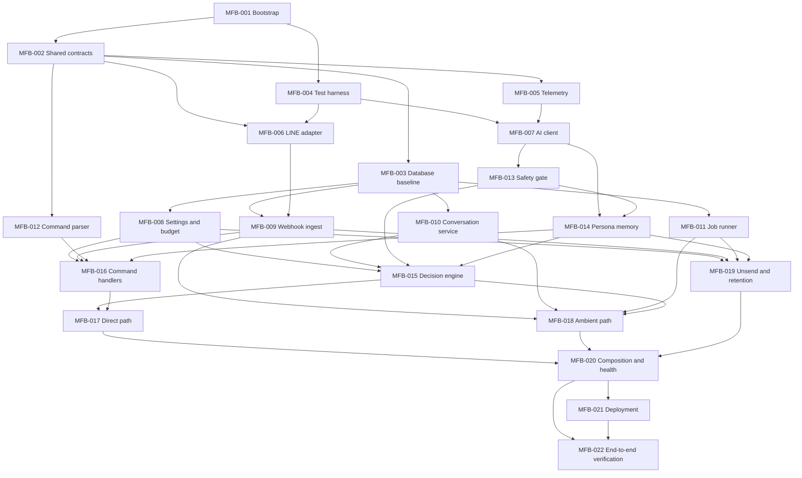

# Implementation Plan: Mallnew Friends Bot MVP

สถานะ: Ready for implementation  
อ้างอิง: `architecture.md`, `domain-glossary.md`, `implementation-contracts.md`, ADR-0001 ถึง ADR-0004  
ขอบเขต: LINE group เดียว, สมาชิกน้อยกว่า 50 คน, ข้อความน้อยกว่า 1,000 ข้อความต่อวัน

## 1. วิธีใช้แผนนี้

เอกสารนี้แบ่งงานให้แต่ละ task ส่งต่อให้ผู้พัฒนาได้โดยไม่ต้องอ่าน task อื่นก่อน แต่ผู้รับงานยังต้องอ่านเอกสารอ้างอิงด้านบนและ code ปัจจุบันก่อนเริ่ม เพื่อไม่ทำลาย contract ที่ task ก่อนหน้าสร้างไว้

กติกาการกระจายงาน:

1. เริ่ม task ได้เมื่อ task ใน `Depends on` merge แล้วทั้งหมด
2. Task ที่อยู่ใน wave เดียวกันทำพร้อมกันได้เมื่อ path ที่ระบุไม่ทับกัน
3. ผู้รับงานแก้เฉพาะ `Owned paths` หากจำเป็นต้องแก้นอกขอบเขต ให้ประสานเจ้าของ task/path ก่อน
4. `src/app/**`, root config และ migration เป็น integration hotspots ห้ามหลาย task แก้พร้อมกัน
5. ทุก task ต้องเพิ่ม test ของพฤติกรรมที่ตนรับผิดชอบ และส่งมอบด้วย lint, typecheck และ test ที่เกี่ยวข้องผ่าน
6. ห้าม deep import ข้าม module; ใช้เฉพาะ `src/modules/<module>/index.ts`
7. เวลาในฐานข้อมูลเป็น UTC ทั้งหมด ส่วน daily budget ตัดวันตาม `Asia/Bangkok`
8. ข้อความจาก LINE เป็น untrusted input; authorization, retention, safety และ state-changing commands ต้องตัดสินด้วย code

## 2. Baseline ทางเทคนิค

เพื่อให้แต่ละ task ตัดสินใจตรงกัน ให้ใช้ baseline ต่อไปนี้จนกว่าจะมี ADR ใหม่:

- Bun โดย pin version ใน `packageManager`, TypeScript strict, ESM และ `bun.lock`
- Elysia สำหรับ HTTP server โดย webhook route ต้องเข้าถึง raw request bytes ก่อน body parsing เพื่อ verify LINE signature
- Kysely + `pg` สำหรับ PostgreSQL และ migration
- OpenAI official SDK สำหรับ Responses API
- LINE Messaging API SDK หรือ thin adapter ที่ mock ได้ โดย domain ห้ามอ้าง SDK type โดยตรง
- Zod หรือ JSON Schema validator ที่รองรับ strict validation ที่ application boundary
- Bun test runner (`bun:test`) สำหรับ unit/integration tests; PostgreSQL integration test ใช้ database แยกที่ reset ได้
- Pino structured logging โดยมี redaction สำหรับ secrets และ authorization headers
- Runtime เป็น modular monolith process เดียว: HTTP server และ background job loop อยู่ process เดียวกัน

ค่าที่ต้อง configurable: model, budget, retention 30/7/180 วัน, ambient delay 15–30 วินาที, cooldown 3–5 นาที, reply-token safety margin 45 วินาที, context limit 30 ข้อความ/10 นาที และ admin LINE user IDs

## 3. Dependency graph และ execution waves

| Wave | Tasks ที่ทำพร้อมกันได้ | หมายเหตุเรื่องการชนกัน |
|---|---|---|
| 0 | `MFB-001` | ทำคนเดียว เพราะสร้าง root config และ directory layout |
| 1 | `MFB-002`, `MFB-004` | แยก `src/shared/**` กับ `test/**`; ให้ `MFB-001` เตรียม scripts/dependencies ไว้แล้ว |
| 2 | `MFB-003`, `MFB-005`, `MFB-006`, `MFB-012` | แต่ละ task มี module/path แยก; migration เป็นของ `MFB-003` คนเดียว |
| 3 | `MFB-007`, `MFB-008`, `MFB-009`, `MFB-010`, `MFB-011` | repository แยก subfolder ตาม owner; ห้ามเพิ่ม migration เอง |
| 4 | `MFB-013`, `MFB-014` | `MFB-014` เริ่มส่วน resolver/repository ได้ แต่ส่วน extraction ต้องรอ public API ของ `MFB-013` |
| 5 | `MFB-015`, `MFB-016`, `MFB-019` | แยก decision, command, lifecycle; integration ผ่าน public ports |
| 6 | `MFB-017`, `MFB-018` | direct และ ambient orchestration แยก directory; ห้ามแก้ `src/app/**` |
| 7 | `MFB-020`, `MFB-021` | `MFB-021` เตรียม container ได้ แต่ final smoke test ต้องรอ `MFB-020` |
| 8 | `MFB-022` | integration gate ก่อนถือว่า MVP พร้อมทดลอง |

Critical path: `MFB-001 → MFB-002 → MFB-003 → MFB-010 → MFB-015 → MFB-017/018 → MFB-020 → MFB-022`

## 4. Tasks

### MFB-001 — Bootstrap repository และ developer workflow

- **Goal:** สร้าง TypeScript project ที่ build/test/run ได้ และกำหนด directory boundary ตาม modular monolith
- **Depends on:** ไม่มี
- **Can run with:** ไม่มี
- **Owned paths:** `package.json`, `bun.lock`, `tsconfig*.json`, lint/format config, `.gitignore`, `.env.example`, `src/app/**` เฉพาะ placeholder, directory placeholders
- **Implementation:**
  - สร้าง package scripts อย่างน้อย `dev`, `build`, `start`, `typecheck`, `lint`, `test`, `test:integration`, `db:migrate` และเรียกผ่าน `bun run`
  - ตั้ง Bun เป็น runtime target ของ build/start และใช้ Elysia เป็น HTTP dependency หลัก โดยไม่เพิ่ม Node-only HTTP framework
  - ติดตั้ง dependency baseline ในหัวข้อ 2 ทั้งหมด เพื่อลดการแก้ `package.json` จาก task อื่น
  - สร้าง layout `src/app`, `src/modules`, `src/shared`, `src/infrastructure/db` และ `test`
  - ตั้ง strict TypeScript, source maps และ production build ที่ไม่รวม tests
  - ใส่ตัวอย่าง environment variables ครบตาม architecture โดยไม่มี secret จริง
- **Acceptance criteria:** `bun install --frozen-lockfile`, `bun run build`, `bun run typecheck`, `bun test` ผ่านบน clean checkout; app placeholder start/stop บน Bun ได้ด้วย exit code ถูกต้อง; ไม่มี secret หรือ generated build artifact ใน Git
- **Out of scope:** HTTP routes จริง, schema, business logic, Docker deployment

### MFB-002 — Shared contracts, configuration และ deterministic primitives

- **Goal:** สร้างภาษากลางของระบบโดยไม่ใส่ business logic ลง `src/shared`
- **Depends on:** `MFB-001`
- **Can run with:** `MFB-004`
- **Owned paths:** `src/shared/**`
- **Implementation:**
  - นิยาม branded IDs/domain types สำหรับ group, member, webhook event, message, job, response, observation และ fact
  - นิยาม clock, random source, ID generator, transaction boundary และ result/error contracts ที่ inject ได้
  - ทำ environment schema พร้อม default ตามหัวข้อ 2 และ fail fast เมื่อค่าบังคับหาย/ผิดรูป
  - สร้าง UTC helpers, Bangkok budget-day helper และ duration constants โดยไม่อ่านเวลาระบบโดยตรงใน domain code
  - นิยาม error taxonomy เช่น validation, unauthorized, conflict, transient infrastructure และ permanent failure
- **Acceptance criteria:** unit tests ครอบคลุม DST-independent Bangkok day boundary, invalid env, duration parsing และ ID/type serialization; module อื่น import shared types ได้โดยไม่อ้าง infrastructure package
- **Out of scope:** module-specific decision rules, repositories และ API clients

### MFB-003 — PostgreSQL schema และ migration baseline

- **Goal:** สร้าง schema ทั้ง MVP ในชุด migration กลาง พร้อม constraints ที่บังคับ invariants สำคัญ
- **Depends on:** `MFB-002`
- **Can run with:** `MFB-005`, `MFB-006`, `MFB-012`
- **Owned paths:** `src/infrastructure/db/migrations/**`, `src/infrastructure/db/types.ts`, migration runner
- **Implementation:**
  - สร้างตารางทั้งหมดตาม implementation contracts: `groups`, `group_settings`, `members`, `member_aliases`, `webhook_events`, `messages`, `message_tombstones`, `conversation_episodes`, `delayed_jobs`, `bot_responses`, `persona_observations`, `persona_facts`, `persona_fact_observations`, `decision_records`, `ai_usage_events`, `feedback_signals`, `audit_events`, `content_debug_logs`
  - บังคับ unique `webhook_event_id`, nullable-unique `line_message_id`, job idempotency key และ response idempotency key
  - เก็บ event timestamp แยกจาก received timestamp; เก็บ reply token พร้อม received/expiry data ที่จำเป็นต่อ safety margin
  - ทำ foreign keys/index สำหรับ context query, due-job polling, persona retrieval, retention sweep และ daily budget aggregation
  - รองรับ observation invalidation และ fact-to-observation traceability; fact ที่ active ต้องย้อนหา observation ได้ใน application transaction
  - เพิ่ม migration metadata/version check สำหรับ readiness endpoint
- **Acceptance criteria:** migrate จากฐานว่างและ rollback/rebuild ใน test environment ได้; schema integration tests พิสูจน์ unique constraints, FK, UTC timestamp round-trip และ indexes ของ critical queries; Kysely types compile
- **Out of scope:** repository behavior และ seed ข้อมูล production

### MFB-004 — Test harness, fixtures และ quality gates

- **Goal:** ให้ทุก module เขียน deterministic unit/integration tests ได้โดยไม่สร้าง helper ซ้ำ
- **Depends on:** `MFB-001`
- **Can run with:** `MFB-002`
- **Owned paths:** `test/**`, Bun test preload/config เฉพาะที่ `MFB-001` เว้น hook ไว้
- **Implementation:**
  - สร้าง fake clock/random/ID generator, LINE/OpenAI fakes และ fixture builders สำหรับ webhook/message/member
  - สร้าง PostgreSQL integration harness ที่ใช้ database URL สำหรับ test, migrate และ truncate ระหว่าง test
  - แยก unit กับ integration suites และป้องกัน integration test ชี้ production database
  - เพิ่ม helpers สำหรับ assert structured logs ไม่มี secret และ assert at-most-once side effect
- **Acceptance criteria:** sample unit/integration tests ผ่านซ้ำได้โดยไม่ขึ้นกับเวลา/ลำดับ; test run แบบ parallel ไม่แชร์ state; suite ปฏิเสธ database URL ที่ไม่ผ่าน safety check
- **Out of scope:** business tests ของ module อื่น

### MFB-005 — Telemetry, redaction และ audit primitives

- **Goal:** สร้าง observability ที่วัด MVP ได้โดยไม่รั่ว secret หรือเนื้อหาเกิน policy
- **Depends on:** `MFB-002`
- **Can run with:** `MFB-003`, `MFB-006`, `MFB-012`
- **Owned paths:** `src/modules/telemetry/**`
- **Implementation:**
  - สร้าง structured logger public API พร้อม correlation IDs สำหรับ webhook, job, decision และ response
  - redact channel secret, access token, OpenAI key, authorization/cookie headers และค่าที่กำหนดเพิ่มได้
  - นิยาม metrics/events: latency, token usage, decision outcome, suppression reason, reply-token age, extraction/correction, safety rejection, feedback และ duplicate response
  - แยก content debug log event ที่มี retention 7 วันจาก operational log ปกติ
  - สร้าง audit-event port สำหรับ mutation สำคัญ โดย actor เป็น LINE `userId`
- **Acceptance criteria:** tests ป้อน secret ใน nested metadata/error แล้ว output ไม่มีค่า secret; event names/required fields ถูก validate; module export ผ่าน `index.ts` เท่านั้น
- **Out of scope:** repository ของ `content_debug_logs`/`audit_events` และ external monitoring stack

### MFB-006 — LINE adapter

- **Goal:** ห่อ LINE protocol/SDK หลัง port ที่ทดสอบได้และไม่รั่ว SDK types เข้า domain
- **Depends on:** `MFB-002`, `MFB-004`
- **Can run with:** `MFB-003`, `MFB-005`, `MFB-012`
- **Owned paths:** `src/modules/line-adapter/**`
- **Implementation:**
  - verify HMAC signature จาก raw bytes ก่อน JSON parse ด้วย constant-time comparison
  - parse เฉพาะ event ที่ MVP รองรับ: text, sticker metadata, non-text metadata, unsend, join/member events และ quoted message ID
  - normalize mention ที่ `isSelf`, source group/user IDs, event timestamp, redelivery flag, reply token และ webhook event ID
  - สร้าง ports สำหรับ reply message และ profile lookup; map transport errors เป็น transient/permanent/unknown outcome
  - reply API รับ response claim proof เพื่อกัน caller ที่ยังไม่ claim idempotency key
- **Acceptance criteria:** official-style signature fixtures ผ่าน/ผิดตามคาด; invalid signature ไม่ parse body; parser ทน unknown fields/event types; reply/profile clients ถูก mock ได้; ไม่มี token ใน logs/errors
- **Out of scope:** persistence, command grammar และ response decision

### MFB-007 — OpenAI Responses API client

- **Goal:** มี AI boundary เดียวที่บังคับ structured output, timeout, retry และ usage accounting
- **Depends on:** `MFB-002`, `MFB-004`, `MFB-005`
- **Can run with:** `MFB-008` ถึง `MFB-012`
- **Owned paths:** `src/modules/ai-client/**`
- **Implementation:**
  - สร้าง generic structured-response method ที่รับ schema, task name, prompt payload และ timeout
  - เรียก model จาก config (`gpt-5-nano` default), validate output ฝั่ง app และ retry ได้สูงสุดหนึ่งครั้งเมื่อ timeout/invalid schema
  - คืน typed failure โดยไม่ซ่อนว่า usage ถูกคิดแล้วหรือไม่; บันทึก token accounting ผ่าน port
  - ป้องกัน prompt payload จากการเปลี่ยน system policy/tool/authorization และจำกัด output size
  - ทำ fake implementation สำหรับ module tests
- **Acceptance criteria:** tests ครอบคลุม valid output, invalid JSON/schema, timeout, retry exactly once, exhausted retry และ usage event; API key/prompt content ไม่ปรากฏใน operational log
- **Out of scope:** prompts/decision policy เฉพาะ persona, safety หรือ response generation

### MFB-008 — Group settings, admin authorization และ daily budget

- **Goal:** รวม state/config ที่ code ต้องใช้ตัดสิน mute, tone, admin และ AI budget
- **Depends on:** `MFB-003`, `MFB-004`, `MFB-005`
- **Can run with:** `MFB-007`, `MFB-009`, `MFB-010`, `MFB-011`
- **Owned paths:** `src/modules/settings/**`, `src/modules/retention/**` เฉพาะ settings ports, `src/infrastructure/db/repositories/settings/**`
- **Implementation:**
  - repository/service สำหรับ group settings: mode `สุภาพ|ปกติ|แซวแรง`, mute-until, daily token budget และ active group
  - admin check จาก exact LINE `userId` allowlist เท่านั้น; display name/ข้อความ/model ห้ามมีผล
  - aggregate `ai_usage_events` ตามวัน `Asia/Bangkok`; เมื่อ budget เต็ม block ambient AI แต่ direct/command ยังทำงานตาม policy
  - ทุก mutation เขียน audit event ใน transaction เดียวกัน
  - เตรียม status snapshot ที่ไม่คืน secret: DB/migration, budget used/limit, mode, mute state
- **Acceptance criteria:** tests ครอบคลุม midnight Bangkok, concurrent usage, mute expiry, unauthorized mutation และ audit atomicity; public API ไม่เปิด raw admin list/secret
- **Out of scope:** parsing command และ HTTP health route

### MFB-009 — Webhook ingest และ durable event recording

- **Goal:** รับ verified event แบบ idempotent บันทึก event/message/job atomically และตอบ LINE เร็ว
- **Depends on:** `MFB-003`, `MFB-004`, `MFB-006`
- **Can run with:** `MFB-007`, `MFB-008`, `MFB-010`, `MFB-011`
- **Owned paths:** `src/modules/webhook-ingest/**`, `src/infrastructure/db/repositories/webhook-ingest/**`
- **Implementation:**
  - แยก verified-event handler ออกจาก HTTP route; invalid signature ถูกหยุดที่ LINE adapter ก่อนถึง handler
  - insert `webhook_events`; duplicate คืนผลสำเร็จโดยไม่สร้าง message/job ซ้ำ
  - persist text, emoji/sticker metadata และ non-text type โดยไม่ดาวน์โหลด media
  - สร้าง direct/ambient/persona/unsend job intents ที่จำเป็นใน transaction เดียวกับ event/message
  - ใช้ LINE event timestamp เป็น ordering source และ received timestamp สำหรับ reply-token age
  - DB error ต้อง propagate เพื่อให้ HTTP layer ตอบ non-2xx
- **Acceptance criteria:** integration tests พิสูจน์ duplicate delivery และ concurrent duplicate สร้าง record/job ชุดเดียว; transaction rollback เมื่อส่วนใดล้ม; non-text ไม่มี binary content; handler ไม่มี AI/network call ก่อน commit
- **Out of scope:** ประมวลผล job, unsend cascade และ HTTP composition

### MFB-010 — Conversation episodes และ context windows

- **Goal:** สร้างบริบทสนทนาที่ deterministic และตรวจการตอบของมนุษย์/บริบทล้าสมัยได้
- **Depends on:** `MFB-003`, `MFB-004`
- **Can run with:** `MFB-007` ถึง `MFB-009`, `MFB-011`
- **Owned paths:** `src/modules/conversation-service/**`, `src/infrastructure/db/repositories/conversation/**`
- **Implementation:**
  - เปิด episode ใหม่เมื่อข้อความแรกมาหลังเงียบเกิน 10 นาที
  - query context สูงสุด 30 ข้อความและย้อนหลังไม่เกิน 10 นาที เรียงด้วย event timestamp พร้อม deterministic tie-breaker
  - เชื่อม quote เฉพาะเมื่อ quoted source ยังอยู่; tombstone/ถูกลบต้องไม่คืน content
  - นิยาม heuristic/port สำหรับ `answered_by_human` และ stale context โดยใช้ message IDs ที่เกี่ยวข้อง
  - context renderer แยก trusted metadata จาก untrusted user text
- **Acceptance criteria:** tests ครอบคลุม episode boundary, out-of-order redelivery, 30-message/10-minute limits, missing quote, tombstone และ human response หลัง candidate; query ไม่คืนข้อความคนที่ถูก forget
- **Out of scope:** model topic selection และการตัดสินว่าจะตอบ

### MFB-011 — PostgreSQL delayed-job runner

- **Goal:** ประมวลผลงาน delayed อย่าง durable, recover หลัง restart และไม่รันงานเดียวกันพร้อมกัน
- **Depends on:** `MFB-003`, `MFB-004`, `MFB-005`
- **Can run with:** `MFB-007` ถึง `MFB-010`
- **Owned paths:** `src/modules/job-runner/**`, `src/infrastructure/db/repositories/job-runner/**`
- **Implementation:**
  - poll due jobs และ claim แบบ atomic (`FOR UPDATE SKIP LOCKED` หรือเทียบเท่า) พร้อม status/locked_at/attempts
  - register handler ตาม job type ผ่าน public API; lifecycle รองรับ done, cancelled, expired และ bounded retry
  - reclaim stale locks หลัง process crash โดยไม่ทำลาย at-most-once response rule
  - cancellation API ตาม source event/message/member และ idempotency key
  - graceful shutdown หยุด poll ใหม่และรอ in-flight ภายใน timeout
- **Acceptance criteria:** integration tests หลาย worker พิสูจน์ job ถูก claim ทีละตัว; restart/reclaim ทำงาน; future job ไม่รันก่อน due; cancelled/expired job ไม่ถูก dispatch; retry จำกัดและมี telemetry
- **Out of scope:** business handler ของ ambient/persona/retention

### MFB-012 — Deterministic command parser และ authorization intent

- **Goal:** parse คำสั่ง MVP ด้วย code ก่อน model และคืน typed intent ที่ handler ตรวจสิทธิ์ต่อได้
- **Depends on:** `MFB-002`, `MFB-004`
- **Can run with:** `MFB-003`, `MFB-005`, `MFB-006`
- **Owned paths:** `src/modules/command-service/parser/**`, `src/modules/command-service/index.ts` เฉพาะ parser API
- **Implementation:**
  - รองรับ `ฉันเป็นใคร`, `แก้ข้อมูลฉัน: ...`, `ลืมฉัน`, `หยุดวิเคราะห์ฉัน`, `จำฉันได้แล้ว`, `เรียกฉันว่า ...`, `เงียบ 1 ชม.`, `โหมด สุภาพ|ปกติ|แซวแรง`, `สถานะ`
  - state-changing command ต้องมี bot mention; normalize whitespace/Thai punctuation อย่างจำกัดโดยไม่เปลี่ยน payload
  - แยก member/admin intents และเก็บ actor `userId`; parser ไม่อนุมัติสิทธิ์เอง
  - ข้อความคล้ายคำสั่งแต่ grammar ไม่ครบต้องคืน `not_command` ไม่เดาโดย model
- **Acceptance criteria:** table-driven tests ครอบคลุมคำสั่งถูก/ผิด, missing mention, mixed Thai-English noise, payload ว่าง, mode ผิด และ spoofed display name; fuzz input ไม่ throw
- **Out of scope:** database mutation และข้อความตอบกลับ

### MFB-013 — Safety Gate

- **Goal:** ตัดสิน draft/fact ก่อนส่ง โดย fail closed ตาม direct/ambient policy
- **Depends on:** `MFB-002`, `MFB-004`, `MFB-007`
- **Can run with:** งานส่วน resolver/repository ของ `MFB-014`
- **Owned paths:** `src/modules/safety-gate/**`
- **Implementation:**
  - deterministic blocklist/classification สำหรับ secret/token/password patterns, real-time location และ policy overrides/prompt injection
  - structured model classification สำหรับหมวดสุขภาพ/บาดแผล, ศาสนา, การเมือง, เพศวิถี, การเงิน, illegal activity, ความลับ และการโจมตีรุนแรง
  - input ประกอบด้วย draft และ fact metadata เท่าที่จำเป็น; user text ไม่สามารถ override policy
  - คืน `allowed|blocked|uncertain` พร้อม machine reason; ambient blocked/uncertain เงียบ, direct ใช้ neutral response ที่ไม่ใช้ risky facts
  - tone mode เปลี่ยนสำนวนได้แต่ลดข้อห้ามไม่ได้
- **Acceptance criteria:** policy fixture suite ทุก prohibited category ถูก block/uncertain; prompt-injection fixtures เปลี่ยน policy ไม่ได้; AI failure เป็น `uncertain`; neutral fallback ไม่มี risky fact; deterministic secret checks ไม่ส่ง secret ไป model
- **Out of scope:** final reply transport และ persona extraction

### MFB-014 — Persona observations, facts, aliases และ memory controls

- **Goal:** เรียนรู้ persona แบบ traceable แก้ conflict ได้ และเคารพ identity/opt-out
- **Depends on:** `MFB-003`, `MFB-004`, `MFB-007`, `MFB-013`
- **Can run with:** ไม่มีหลัง dependency ครบ; ส่วน repository/resolver เริ่มคู่ `MFB-013` ได้โดยยังไม่ต่อ extraction
- **Owned paths:** `src/modules/persona-service/**`, `src/infrastructure/db/repositories/persona/**`
- **Implementation:**
  - extraction schema สำหรับ category ที่กำหนด, claim, subject candidate, source type และ confidence; เก็บ observation ก่อน resolve fact
  - source weights: self explicit 0.90, behavioral 0.60, third party 0.30, self correction 1.00
  - resolver ใช้ recency, source weight, corroboration และ conflict โดยไม่ overwrite observation; active fact link observations อย่างน้อยหนึ่งตัว
  - canonical identity เป็น LINE `userId`; aliases ใช้ได้เมื่อ unique/confident เท่านั้น ชื่อชนหรือคะแนนต่ำห้ามผูก fact
  - visibility `public_safe|risky`; Safety Gate มีอำนาจลด visibility/ห้ามใช้
  - opt-out หยุด observation/fact ใหม่แต่ยังใช้ข้อความ current window; opt-in เปิดการเรียนรู้ครั้งถัดไป
  - retrieval ใช้ member/category/active/confidence เท่านั้น ไม่มี embeddings
- **Acceptance criteria:** tests ครอบคลุม weight ordering, explicit correction, conflicting evidence, alias collision, unknown profile, opt-out/in, risky visibility และ observation traceability; concurrent extraction idempotent ตาม source message
- **Out of scope:** forget cascade, unsend cascade และ 180-day decay worker ซึ่งอยู่ `MFB-019`

### MFB-015 — Selective-response decision engine

- **Goal:** ตัดสิน direct/ambient ด้วย hard rules + small-model structured decision โดย code เป็น final authority
- **Depends on:** `MFB-007`, `MFB-008`, `MFB-010`, `MFB-013`, `MFB-014`
- **Can run with:** `MFB-016`, `MFB-019`
- **Owned paths:** `src/modules/decision-engine/**`, `src/infrastructure/db/repositories/decision-engine/**`
- **Implementation:**
  - direct detection contract: self mention, reply/quote ถึง bot response ที่รู้จัก หรือ parsed command
  - ambient hard filters: non-text, sticker-only, `555`, short acknowledgment, duplicate, mute, cooldown, response budget และ AI daily budget
  - enforce ไม่เกิน 1 ambient response ต่อ 10 substantive messages และ cooldown configurable 3–5 นาที
  - model schema ต้องมี `respond`, `reason`, `interest_score`, `answered_by_human`, `safety`, `draft`, `used_fact_ids`; validate fact IDs ว่าอนุญาตและอยู่ใน supplied context
  - persist decision/suppression reason และ usage; direct ข้าม random sampling แต่ไม่ข้าม mute/authorization/safety
  - OpenAI failure: retry ตาม client แล้ว direct neutral fallback, ambient cancel
- **Acceptance criteria:** deterministic tests ทุก hard rule; model ไม่สามารถ override budget/mute/safety; ambient target policy วัดได้จาก records; invalid fact ID/schema ถูก reject; direct/ambient failure behavior ตรง implementation contracts
- **Out of scope:** scheduling และส่ง LINE reply จริง

### MFB-016 — Command handlers และ member/admin controls

- **Goal:** ทำให้ command intents เกิด mutation/query ที่ถูกสิทธิ์ มี audit และตอบข้อความปลอดภัย
- **Depends on:** `MFB-006`, `MFB-008`, `MFB-009`, `MFB-012`, `MFB-014`
- **Can run with:** `MFB-015`, `MFB-019`
- **Owned paths:** `src/modules/command-service/handlers/**`, public exports ของ `command-service` ที่ parser task เตรียมไว้
- **Implementation:**
  - member commands ดู/แก้/ลบ persona, opt-out/in และ alias ทำได้เฉพาะ actor ของตนเอง
  - admin commands mute, mode และ status ตรวจ exact allowlist ก่อน mutation
  - correction สร้าง self-correction observation น้ำหนัก 1.00; persona view แสดงเฉพาะข้อมูลของ actor และคำอธิบาย opt-out/forget ที่ไม่กำกวม
  - mutation และ audit event อยู่ transaction เดียวกัน; response ไม่มี secret/raw admin list
  - `ลืมฉัน` ส่งต่อ lifecycle operation ให้ `MFB-019` แทนการลบเอง
- **Acceptance criteria:** unauthorized user เปลี่ยน admin state ไม่ได้; member แตะ persona คนอื่นไม่ได้; ทุก successful mutation มี audit record; handlers idempotent เมื่อ command event ถูก replay; copy อธิบายว่า forget เรียนรู้ใหม่ได้แต่ opt-out หยุด long-term memory
- **Out of scope:** transport orchestration และ deletion cascade implementation

### MFB-017 — Direct invocation pipeline

- **Goal:** ประมวลผล mention/reply/command ให้ตอบภายในเป้าหมาย 3–5 วินาทีและส่งได้ไม่เกินหนึ่งครั้ง
- **Depends on:** `MFB-006`, `MFB-009`, `MFB-010`, `MFB-013`, `MFB-015`, `MFB-016`
- **Can run with:** `MFB-018`
- **Owned paths:** `src/modules/direct-pipeline/**`
- **Implementation:**
  - route command intent ไป command handler; direct conversation route ไป context → decision/generation → safety
  - ก่อน LINE reply ต้อง claim response idempotency key ใน irreversible transaction
  - transport timeout หลัง claim ถือ outcome ไม่ทราบและห้าม retry อัตโนมัติ
  - reply token อายุเกิน 45 วินาทีให้ expire; ห้าม push fallback
  - safety blocked/uncertain หรือ AI failure ใช้ neutral fallback ที่ไม่อ้าง risky fact เมื่อ token ยังสด
  - persist bot response/decision correlation และ latency telemetry
- **Acceptance criteria:** concurrent duplicate direct jobs ส่ง adapter ไม่เกินหนึ่งครั้ง; timeout-after-claim ไม่ retry; stale token ไม่ส่ง; command bypass model generation เมื่อไม่จำเป็น; latency budget มี metric/test ด้วย fake clock
- **Out of scope:** HTTP/app composition และ ambient scheduling

### MFB-018 — Ambient candidate pipeline

- **Goal:** รอ 15–30 วินาทีเพื่ออ่านบรรยากาศ ยกเลิกเมื่อบริบทเปลี่ยน และตอบเฉพาะ candidate ที่ผ่านทุก gate
- **Depends on:** `MFB-006`, `MFB-009`, `MFB-010`, `MFB-011`, `MFB-013`, `MFB-015`
- **Can run with:** `MFB-017`
- **Owned paths:** `src/modules/ambient-pipeline/**`
- **Implementation:**
  - สร้าง candidate หลัง hard prefilter ด้วย random delay ที่ inject ได้ในช่วง 15–30 วินาที
  - เมื่อ due ให้ rebuild context แล้ว cancel หากมนุษย์ตอบ, relevant topic stale, mute/cooldown/budget เปลี่ยน หรือ reply token เกิน margin
  - เรียก decision engine/Safety Gate แล้ว claim response idempotency keyก่อน reply เช่นเดียวกับ direct
  - AI/safety/transport uncertainty จบด้วย silence; ห้าม neutral fallback และห้าม push
  - record suppression reason ทุกทางเพื่อคำนวณ response rate
- **Acceptance criteria:** fake-clock tests ยืนยันไม่ตอบก่อน due; human response/stale context/cooldown/stale token cancel; restart ทำต่อเฉพาะ token ยังสด; duplicate candidates/worker concurrency ไม่ส่งซ้ำ; ambient failure เงียบเสมอ
- **Out of scope:** global app startup และ retention sweep

### MFB-019 — Unsend, forget, retention และ persona decay

- **Goal:** ทำ data lifecycle ให้ครบ โดย deletion/invalidation atomic และข้อมูลที่ลบแล้วไม่กลับมาใน context/persona
- **Depends on:** `MFB-008`, `MFB-009`, `MFB-011`, `MFB-014`
- **Can run with:** `MFB-015`, `MFB-016`
- **Owned paths:** `src/modules/retention/**`, `src/modules/data-lifecycle/**`, `src/infrastructure/db/repositories/retention/**`
- **Implementation:**
  - unsend: tombstone/ลบ source content, cancel related jobs, invalidate observations และ recompute/archive facts ที่เสียหลักฐาน
  - forget me: ลบ raw messages และ persona ปัจจุบันของ actor พร้อม job ที่พึ่งข้อมูลนั้น แต่ไม่ตั้ง opt-out และไม่ลบ persona สมาชิกอื่นจากข้อความเดียวกันโดยไม่ประเมิน subject
  - scheduled sweep ลบ raw messagesเกิน 30 วันและ content debug logs เกิน 7 วัน; เก็บ minimum tombstone/idempotency metadata ที่ไม่มี content
  - facts ไม่มีหลักฐานใหม่ 180 วันต้อง decay confidence หรือ archive แบบ deterministic
  - member leave ไม่ลบ persona; ทุก manual lifecycle mutation มี audit
- **Acceptance criteria:** integration tests ยืนยัน unsend/forget ไม่เหลือ content ใน context/retrieval, jobs ถูก cancel, facts recompute, opt-out แยกจาก forget, member leave ไม่ลบ, sweep boundary ถูกต้อง และ rerun idempotent
- **Out of scope:** backup (MVP ตัดสินใจไม่มี backup) และ media deletion เพราะไม่ดาวน์โหลด media

### MFB-020 — Composition root, Elysia HTTP server และ graceful lifecycle

- **Goal:** ประกอบ infrastructure กับ modules ที่ `src/app` จุดเดียว และเปิด webhook/health endpoints พร้อม run worker
- **Depends on:** `MFB-005`, `MFB-017`, `MFB-018`, `MFB-019`
- **Can run with:** เตรียมส่วนต้นของ `MFB-021` ที่ไม่ต้องอาศัย final command
- **Owned paths:** `src/app/**`
- **Implementation:**
  - wire config, DB, repositories, adapters, services, pipelines และ job handlers โดย module ไม่ import concrete implementation กันเอง
  - สร้าง Elysia app และให้ `POST /webhooks/line` รับ raw UTF-8 bytes, verify signature ก่อน parse, map invalid signature เป็น reject, duplicate เป็น 2xx และ DB ingest failure เป็น non-2xx
  - `/health/live` ตรวจ process; `/health/ready` ตรวจ DB และ migration version โดยไม่เผย config/secret
  - start HTTP และ job loop ใน process เดียว; shutdown ปิดรับ request, drain worker แล้วปิด DB/client
  - bootstrap active group และแจ้ง transparency/memory controls เมื่อ join ตาม policy
- **Acceptance criteria:** HTTP integration tests ครอบคลุม invalid signature/no persistence, valid webhook/fast 2xx, duplicate, DB down/non-2xx และ health states; dependency-boundary test ไม่พบ deep import; SIGTERM shutdown จบ cleanly
- **Out of scope:** reverse proxy certificate และ production host provisioning

### MFB-021 — Docker Compose และ production runbook

- **Goal:** deploy `bot-app` + `postgres` บน private Docker network และมีวิธี migrate/start/rollback ที่ทำตามได้
- **Depends on:** `MFB-001`; final smoke test depends on `MFB-020`
- **Can run with:** `MFB-020` เฉพาะ Dockerfile/Compose draft
- **Owned paths:** `Dockerfile`, `compose.yaml`, `.dockerignore`, `docs/runbook.md`, deployment scripts/config ที่ไม่อยู่ `src/app`
- **Implementation:**
  - multi-stage image จาก Bun official image ที่ pin version, รันด้วย non-root user, install เฉพาะ production dependencies, มี healthcheck และ graceful stop
  - Compose มี `bot-app`/`postgres`, persistent volume, private DB port, env-file/secrets injection และ restart policy
  - migration เป็น explicit release step ที่ fail แล้วไม่ start app; readiness เช็ค schema version
  - runbook ครอบคลุม LINE webhook URL, reverse proxy/TLS, env setup, deploy, logs, migration failure, database loss และการเริ่มเรียนรู้ใหม่
  - ระบุชัดว่า MVP ไม่มี backup และไม่เปิด PostgreSQL สู่ public network
- **Acceptance criteria:** `docker compose config` ผ่าน; build image สำเร็จ; local smoke start ทำให้ live/ready healthy และ webhook route reachable; image/compose ไม่มี secret; runbook ทำตามจาก clean host ได้
- **Out of scope:** cloud IaC, horizontal scaling, Redis และ automated backup

### MFB-022 — End-to-end verification และ MVP evaluation gate

- **Goal:** พิสูจน์ระบบครบ flow/failure contracts และเตรียม metrics สำหรับทดลองสองสัปดาห์
- **Depends on:** `MFB-020`, `MFB-021`
- **Can run with:** ไม่มี
- **Owned paths:** `test/e2e/**`, `docs/test-plan.md`, `docs/evaluation-runbook.md`; แก้ production codeได้เฉพาะ bug ที่พบและต้องประสานเจ้าของ module
- **Implementation:**
  - E2E scenarios: valid/invalid webhook, direct mention, reply-to-bot, command, ambient respond/ignore, human cancellation, duplicate/redelivery, restart, stale token และ unsend
  - privacy/safety scenarios: persona learn/view/correct/forget, opt-out/in, alias collision, prohibited topics, prompt injection, secret redaction และ unauthorized admin
  - failure injection: OpenAI timeout/invalid schema, LINE timeout-after-claim, PostgreSQL unavailable และ out-of-order events
  - load smoke ที่ 1,000 messages/day equivalent burst โดยตรวจ webhook latency, job backlog และ duplicate response เป็นศูนย์
  - evaluation dashboard/query หรือ documented SQL สำหรับ ambient rate 5–10%, follow-up ภายใน 5 นาที ≥30%, negative feedback ≤10%, token budget, suppression distribution และ safety rejection
- **Acceptance criteria:** automated E2E suite ผ่านบน Compose; duplicate response เท่ากับศูนย์; failure outcomes ตรง contract ทุกกรณี; test/evaluation runbooks มีคำสั่งและ expected result; มี go/no-go checklist สำหรับเริ่มทดลองสองสัปดาห์
- **Out of scope:** ปรับ model จากผลทดลองจริงและ phase-2 dashboard/icebreaker

## 5. Integration rules สำหรับผู้กระจายงาน

ก่อน assign task ให้ส่งเฉพาะ task section นั้นพร้อมลิงก์เอกสารอ้างอิง และระบุ commit/branch ของ dependencies ที่ merge แล้ว ผู้รับงานต้องรายงาน:

1. public API หรือ migration contract ที่เพิ่ม/เปลี่ยน
2. รายชื่อไฟล์นอก `Owned paths` ที่จำเป็นต้องแตะก่อนลงมือ
3. test command และผลลัพธ์
4. known limitations ที่อยู่ใน `Out of scope`

ลำดับ merge ภายใน wave ให้ merge contract/provider ก่อน consumer หาก public API ต่างจากแผน ให้แก้ contract ที่ต้นทางและแจ้ง consumer ทุกคน ห้ามแก้ด้วย deep import หรือ duplicate type ชั่วคราว

Definition of Done ของทุก task:

- acceptance criteria ของ task ผ่านครบ
- unit/integration tests ของ behavior ใหม่ผ่าน
- `bun run lint`, `bun run typecheck`, `bun test` ผ่าน
- ไม่มี secret, raw authorization header หรือ dependency ที่อยู่นอก baseline โดยไม่มีเหตุผลบันทึกไว้
- public API export ผ่าน module `index.ts`; ไม่มี deep import ข้าม module
- เอกสารอ้างอิงถูกอัปเดตเฉพาะเมื่อ implementation ทำให้ contract เปลี่ยน และการเปลี่ยน decision สำคัญมี ADR ใหม่

## 6. สิ่งที่ไม่อยู่ใน MVP

ไม่ควรแตก task เพิ่มในรอบนี้สำหรับ dashboard, vector database, embeddings, Redis/message broker, microservices, scheduled icebreaker, media download/analysis, import ประวัติก่อนเชิญ bot, push fallback, horizontal scaling, backup หรือ consent state machine หากต้องเพิ่มข้อใดต้องทบทวน architecture และออก ADR ก่อน
